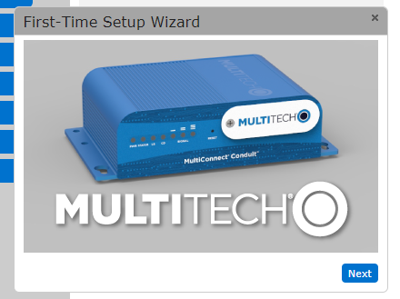

#  Gateway

To set up the device for the first time you need to:
Plug in the antenna, power then ethernet, the ethernet cable is then plugged into the computer you want to manage the conduit from.
Wait until the status light starts to blink approximately 30 seconds and then go to 192.168.2.1 which is the factory ip address of the conduit.

By default DHCP is disabled, When connecting to the conduit you may have to change the computers NIC to be on the same subnet, I did not need to do this.
