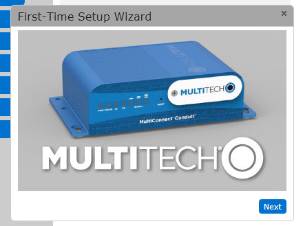
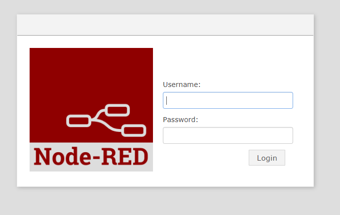

#  Multitech Conduit Gateway

To set up the device for the first time you need to:
Plug in the antenna, power then ethernet, the ethernet cable is then plugged into the computer you want to manage the conduit from.
Wait until the status light starts to blink approximately 30 seconds and then go to 192.168.2.1 which is the factory ip address of the conduit.

By default DHCP is disabled, When connecting to the conduit you may have to change the computers NIC to be on the same subnet, I did not need to do this.

The first time setup wizard then pops up you click next then you have the option to change the password, changing the password is highly recommended.

Once you click the next button you are prompted to enter the current date, time and time zone.  Once entered click next.

You are then asked what type of connection you are making using the ethernet port, make sure to change the type from LAN to WAN and change the mode from DHCP to Static.  It is important to know that when you set the connection type to WAN you will not be able to directly connect to the conduit, you will instead connect to it using the static ip address set to it.
The ip address, mask, gateway address and DNS servers then need to be added.  In this case Google's DNS servers where used.

Click next when ready to proceed.

The ports for HTTP and HTTPS can be changed as well as access to the device from WAN and LAN.  Then click the finish button.  The wizard will close and you will see the menu to the left, click Administration and the menu will expand then click on Access Configuration.

The settings that we changed for development included enabling HTTP Redirect to HTTPS via WAN, HTTPS via WAN, SSH via WAN (note that this is important to connect to the device remotely).
If using Node-Red then check the Via WAN check box.  Once complete click submit.  Before deployment some features may need to be disabled.

To edit the ip address settings go to Network Interfaces under the Setup menu.

Click the edit pencil on the eth0 interface.

The interface can now be edited, this is a similar configuration screen to the wizard.  Note the warning that pops up if the interface type is set to WAN.  Once finished with configuring the interface click finish.

Then click the save and restart option from the menu, click confirm to proceed.

To set up the LoRa network server go to the LoRa Network Server option under the setup menu.

Ensure the enabled check box is checked, change the channel plan to AU915, change the frequency sub-band (in this case it is set to 1).  Change the Tx Power (dBm) here it was lowered from the maximum as for testing only a short range was need.  The Network ID should be set to Name and the Network Key needs to be set to passphrase the Name and Passphrase fields need to match the respective fields you will set for the mDot Box.  Other settings can be ignored for now, click submit when finished.

# Setting up Node-RED
To use Node-RED after configuring the above you must check the Via WAN check box in Access configuration.

To use Node-RED, click apps from the menu.

Check the enabled checkbox and then click launch Node-RED.

Node-RED can then be accessed by going to 192.168.0.155:1880 
Note the ip address may be different depending on what you set it to during the setup and the port number may also be different if it was changed.  The default login uses the same credentials as used for the Multitech conduit AEP (Application Execution Platform) login.  It is recommended to change the username and/or password before deployment.

