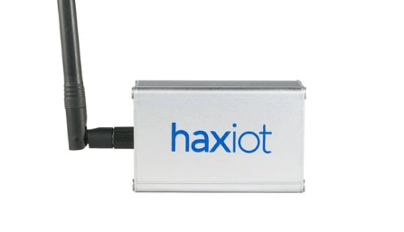

<h1 id="deviceheader"> Research on Gateways</h1>

<h2 id="deviceheader"> Kerlink LoRa IoT Station </h2>

 Industrial solution that is Ip 67 rated for harsh conditions therefore suited to outdoor applications without modification.  
Closed source hardware and software making it difficult to fix and find information about it without contacting the company.  
Uses PoE (Power over Ethernet) and includes outdoor mounting hardware for easy installation.  
Runs linux on an ARM processor and uses Ethernet or a 3G cellular data connection as its backhaul. 

<h2 id="deviceheader"> Multitech Conduit</h2>

Configurable solution with many options available due to having expansion bays.  
Uses a LoRaWAN mCard to support thousands of MultiConnect mDot modules.
Committed support and lots of easy to understand documentation.

<h2 id="deviceheader"> MultiConnect mDot modules: </h2>

Suitible for New Zealand frequencies as they support 868 MHz SRD 
and 915 MHz ISM bands (New Zealand). 

Though the Kerlink LoRa IoT Station and Multitech Conduit are great solutions they are also more expensive than some other solutions. 

<h2 id="deviceheader"> Haxiot gateway</h2>

Requires a raspberry pi or configured virtual machine to act as a gateway.
Guides and example code is offered.

<h2 id="deviceheader"> Haxiot Arduino shield: </h2>

Information about the shield and how to use it can 
conflict at times…

